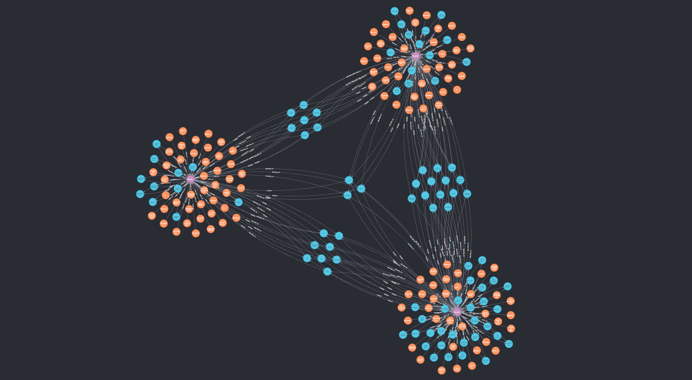

# ContextSearch - from raw files to efficient Semantic Search (WIP)

Start date 22.08.2024

## Overview

This project aims to develop an easy-in-use automated system for Semantic searching through the files. Two main scenarios for which the project wants to expand are personal semantic searching (searching for information in books, documents, and other documents), and as an interface for advanced grounding methods for Large Language Models (LLMs) projects line Retrieval Augmented Generation (RAG) or LoRA/QLoRA (Low-Rank Adaptation). As the main goal is availability, the system will support various ways of interactions from GUI, through CLI with Click, and REST API with FastAPI to gRPC with protobuf.  

The Context Search functionality searches for documents in the given directories and read them for further processing. When a scanned document occures in the set, Tesseract 5 OCR is used to extract the text from the image. Later, the data is trnsformed, preprocessed, and submitted to the Neo4j database. During the retrieval phase, the exact chunk of text is returned together with the simillarity score.

    First Graph created with automatic generation. Graph of three ai-generated articles (pink node), text chunks with embedding (orange nodes), and keywords/tags with embeddings (blue nodes).

## Features
- **Automatic file processing**: One function to submit all files and one function to search for answers.
- **OCR Integration**: Ragger doesn't care if you throw a real or scanned PDF into it. He is here to provide.
- **Neo4j Database Storage**: Store the extracted embeddings in a Neo4j graph database for efficient querying and retrieval. Keep tuned for some interesting optimizations that are planned.

## Future Plans
- **Julia port**: As Julia programing lenguage annouced the improved executable compilation into small files, it will be a perfect use for production deployment of the system.
- **Interfaces**: Currently, Context Search is designed to be used as a Python package, but the goal is to make it as accessible as possible so that even non-technical users can search through their documents. According to the development plan, the REST API will be the first to be implemented.
- **File type expansion**: The project is starting with minimal complexity, one major filetype (PDF) one database, simple execution paths, and high modularity. With maturation of the system, it will expand the support for other document files (docx, md, pptx).
- **Interface for LLM-grounding**: Even though the project started strictly as a tool for LLM, the interest in the semantic search possibility amongst my friends and family made me focus more on this side of the project. However, the plan did not change, the system will support direct LLM integration.
- **Database independence**: The end goal is to prepare adapters and adapter creation manuals for integrating different databases. The chages in the industry make it curently impossible to predict what will be the new state-of-the-art when it comes to vector and graph databases.

## Getting Started
### Prerequisites
- Python 3.10+
- Neo4j Database
- Tesseract OCR (for OCR functionality)
    
    Available:

    Windows -> https://github.com/UB-Mannheim/tesseract/wiki
    
    Linux -> https://tesseract-ocr.github.io/tessdoc/Installation.html

- Poppler (for OCR)

    Available:

    Docs -> https://poppler.freedesktop.org/

### Build the project

The project currently is not mature enough to be submitted to PYPI, that's why the preferable way of running Ragger is to clone the solution, run `pip install .` and modify the config to match your system needs. If you have tesseract and poppler in the PATH, the Ragger will read it by itself.

### Alternative build (Docker)

Use docker-compose files which are ready to use without any tinkering with the config file. 

### Run seamntic search

Refer to `examples/example_submit.py` on how to upload files to the database and to `examples/example_retrieve.py` on how to retrieve data. The extensive tutorial is "in progress".

## Contributing
Please, hold on with the contribution until the first major release. Feel free to fork and initiate discussion if you want to. Always happy to hear some voices of reason!

## License
This project is licensed under the GPL-3.0 License. See the LICENSE file for details.

## Contact
For any questions or suggestions, please approach me directly, open the issue or e-mail me via mail r2.acumen@gmail.com.
